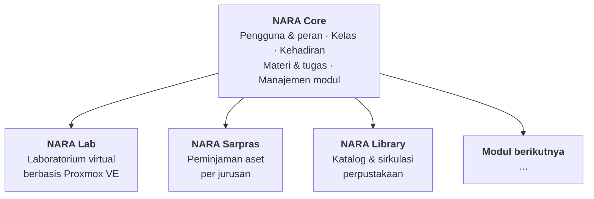

# NARA

**Networked Academic Resource Architecture**

Platform manajemen sekolah sumber terbuka yang modular — dipasang di server sekolah sendiri, datanya tidak ke mana-mana.

---

> [!WARNING]
> **NARA belum dirilis dan belum siap dipakai di sekolah.**
> Proyek ini sedang dalam pengembangan aktif menuju rilis pertama (`v0.1.0`). Belum ada versi yang bisa dipasang, dan API maupun skema basis data masih bisa berubah sewaktu-waktu. Halaman ini ada supaya siapa pun yang tertarik bisa mengikuti perkembangannya sejak awal.

---

## Apa itu NARA

NARA adalah perangkat lunak manajemen sekolah yang **dipasang sendiri oleh sekolah** di servernya. Bukan layanan berlangganan, bukan cloud pihak ketiga. Sekolah mengunduh, memasang, dan memilikinya sepenuhnya.

Yang membedakannya dari aplikasi sekolah lain adalah **arsitektur modularnya**. NARA tidak datang sebagai satu paket raksasa berisi puluhan fitur yang kebanyakan tidak dipakai. Sekolah memasang bagian intinya, lalu menambahkan modul sesuai kebutuhannya masing-masing.

SMK Tata Boga dan SMK Teknik Komputer punya kebutuhan yang sangat berbeda. Keduanya butuh absensi dan materi pembelajaran; hanya satu yang butuh laboratorium virtual. Tidak masuk akal memaksa keduanya menanggung sistem yang sama.

---

## Masalah yang ingin kami selesaikan

**Sekolah kehilangan kendali atas datanya.** Banyak aplikasi sekolah menyimpan data siswa di server vendor. Ketika berhenti berlangganan, data itu sulit dibawa pulang.

**Sistem serba ada terasa berat dan membingungkan.** Guru harus melewati puluhan menu yang tidak pernah dipakai sekolahnya untuk mencapai satu fitur yang ia butuhkan.

**Lab komputer menghabiskan jam pelajaran.** Setiap mata pelajaran praktik butuh konfigurasi berbeda. Guru kehilangan waktu mengajar untuk memasang perangkat lunak, dan siswa dengan laptop seadanya tertinggal karena tidak kuat menjalankannya.

**Biaya lisensi memberatkan.** Sekolah dengan anggaran terbatas sering harus memilih antara perangkat lunak yang layak atau kebutuhan lain yang sama pentingnya.

---

## Cara kerja NARA

**NARA Core** menangani kebutuhan dasar yang dimiliki semua sekolah. Ia berdiri sendiri — sekolah yang hanya butuh ini tidak perlu memasang apa pun lagi.

**Modul** ditambahkan dari halaman admin, tanpa membuka terminal. Sekolah yang tidak memasang sebuah modul tidak pernah mengunduh kodenya, tidak punya tabelnya di basis data, dan tidak perlu tahu teknologi di baliknya.

Aturan arsitekturnya satu dan tidak bisa ditawar: **modul boleh bergantung pada Core, Core tidak boleh tahu satu pun modul.** Aturan ini kami jaga lewat pemeriksaan otomatis di CI — hapus seluruh folder modul, Core harus tetap bisa dibangun dan lulus seluruh pengujiannya.

---

## Yang sedang dibangun

### NARA Core

| | |
|---|---|
| **Pengguna & peran** | Admin, guru, wali kelas, siswa — dengan hak akses yang dapat dibatasi per jurusan |
| **Struktur sekolah** | Jurusan, rombel, mata pelajaran, penugasan guru |
| **Kehadiran** | Absensi satu kelas dalam hitungan detik, dengan koreksi yang meninggalkan jejak |
| **Pembelajaran** | Distribusi materi, penugasan dengan tenggat, pengumpulan oleh siswa |
| **Notifikasi** | Pemberitahuan dalam aplikasi, kategorinya dapat diperluas modul |
| **Manajemen modul** | Pasang, aktifkan, dan nonaktifkan modul dari antarmuka |
| **Instalasi** | Satu perintah, dengan pemeriksaan lingkungan otomatis |

### NARA Lab

Modul pertama, untuk sekolah dengan praktikum berbasis komputer.

Guru membuat sesi lab: memilih sistem operasi, menentukan jumlah mesin, lalu menekan satu tombol. Sistem menyiapkan mesin virtual di Proxmox VE, masing-masing dengan kredensial uniknya sendiri.

Siswa membukanya **langsung dari browser** — tampilan konsol grafis maupun terminal, tanpa memasang apa pun di laptopnya. Tersedia juga akses SSH bagi yang lebih suka terminalnya sendiri. Ketika konfigurasinya rusak karena bereksperimen, satu tombol mengembalikan mesinnya ke kondisi semula.

Jaringan tiap sesi terisolasi, sehingga percobaan siswa tidak pernah mengganggu jaringan sekolah.

---

## Prinsip yang kami pegang

**Data milik sekolah.** NARA berjalan di server sekolah. Tidak ada data yang dikirim ke mana pun. Tidak ada telemetri.

**Mudah dipasang, atau tidak ada gunanya.** Sekolah biasanya hanya punya satu orang IT yang sering merangkap mengajar. Kalau pemasangan butuh keahlian khusus, perangkat lunaknya tidak akan pernah terpakai — sebagus apa pun isinya.

**Hanya pasang yang dibutuhkan.** Fitur yang tidak dipakai bukan sekadar menu yang menganggur; ia menambah beban server, permukaan serang, dan kebingungan pengguna.

**Membosankan itu bagus.** Kami memilih teknologi yang matang dan mudah dipahami, bukan yang paling menarik. Perangkat lunak yang dipasang di sekolah harus bisa dirawat bertahun-tahun oleh orang yang berganti-ganti.

**Terbuka untuk diperiksa.** Kode yang memasang sesuatu di server orang lain harus bisa dibaca siapa pun.

---

## Peta jalan

### `v0.1.0` — Rilis pertama

Target: NARA Core dan NARA Lab dalam bentuk paling dasar yang benar-benar dapat dipakai satu sekolah.

- [ ] NARA Core: pengguna, kelas, kehadiran, materi, tugas
- [ ] Instalasi satu perintah
- [ ] Sistem modul dan pemasangan dari antarmuka
- [ ] NARA Lab: sesi lab, konsol browser, SSH, isolasi jaringan
- [ ] Dokumentasi instalasi, panduan guru, panduan siswa

### `v0.2.0` — Setelah uji coba di sekolah

Ditentukan berdasarkan pemakaian nyata, bukan dugaan. Yang sudah masuk daftar: penilaian tugas, rekap kehadiran, pengumuman tersegmentasi, notifikasi di luar aplikasi, dan kemampuan guru melihat layar siswa untuk membantu.

### Modul berikutnya

**NARA Sarpras** — peminjaman ruang dan alat, dengan kepemilikan dan persetujuan per jurusan.
**NARA Library** — katalog dan sirkulasi perpustakaan.

Keduanya sekaligus menjadi ujian bagi arsitektur modul: kalau menambahkan modul kedua ternyata mudah, kami merancangnya dengan benar.

### Yang sedang dipertimbangkan

Paket instalasi luring untuk sekolah dengan internet terbatas · katalog sistem operasi lab yang lebih lengkap · topologi multi-mesin per siswa untuk praktik jaringan · modul ujian berbasis komputer.

### Yang tidak direncanakan

Layanan berlangganan yang kami operasikan · penyimpanan data sekolah di server kami · aplikasi mobile native.

---

## Teknologi

| | |
|---|---|
| **Backend** | Go — satu binary statis, tanpa runtime, image di bawah 30 MB |
| **Frontend** | Nuxt dalam mode SPA, ditanam ke dalam binary |
| **Basis data** | PostgreSQL, dengan schema terpisah untuk tiap modul |
| **Virtualisasi** | Proxmox VE (khusus NARA Lab) |
| **Penerapan** | Docker Compose — tiga kontainer untuk Core |

Pilihan ini diambil dengan satu pertimbangan utama: sekolah harus bisa memasangnya tanpa bantuan kami.

---

## Repositori

| Repositori | Isi |
|---|---|
| [`nara`](https://github.com/nara-idn) | Monorepo — Core, modul, dan agent |
| [`catalog`](https://github.com/nara-idn) | Katalog modul resmi beserta tanda tangannya |
| [`docs`](https://github.com/nara-idn) | Dokumentasi dan panduan pengguna |

Kami memakai monorepo untuk pengembangan, tetapi **setiap komponen dirilis secara terpisah** dengan versinya sendiri. Sekolah tidak pernah mengunduh repositori — yang diunduh hanyalah image komponen yang benar-benar dipakai.

---

## Ikut terlibat

Proyek ini dikerjakan tim kecil yang bekerja paruh waktu, jadi kami sangat terbuka pada bantuan apa pun.

**Kalau Anda guru atau tenaga IT sekolah** — masukan Anda lebih berharga daripada kode. Ceritakan alur kerja di sekolah Anda, apa yang paling memakan waktu, dan apa yang membuat sistem sebelumnya gagal dipakai. Buka [Discussions](https://github.com/orgs/nara-idn/discussions).

**Kalau Anda pengembang** — kami akan membuka isu bertanda `good first issue` begitu kode dipublikasikan. Modul adalah jalur kontribusi paling mudah: Anda bisa menulis modul sendiri tanpa menyentuh Core sama sekali.

**Kalau sekolah Anda ingin menjadi tempat uji coba** — kami mencari satu atau dua SMK yang bersedia mencoba NARA lebih awal, dengan pendampingan langsung dari kami. Hubungi kami lewat Discussions.

> Catatan jujur soal dukungan: kami mengerjakan ini di luar kesibukan utama. Kami akan menjawab isu dan pertanyaan sebisa kami, tetapi tidak dapat menjanjikan waktu tanggapan tertentu.

---

## Lisensi

[AGPL-3.0](https://www.gnu.org/licenses/agpl-3.0). Sekolah bebas memakai, mempelajari, mengubah, dan membagikannya. Bila NARA dijadikan layanan daring bagi pihak lain, perubahan kodenya juga harus dibagikan.

---

## Nama

**NARA** — *Networked Academic Resource Architecture*.

Kata terakhirnya bukan kebetulan. Kami tidak sedang membangun satu aplikasi sekolah, melainkan fondasi yang bisa ditumbuhi modul-modul baru seiring kebutuhan sekolah berubah.

---

Dibuat di Indonesia, untuk sekolah Indonesia.

 

<b>English summary</b>

 

**NARA** (Networked Academic Resource Architecture) is open-source, self-hosted school management software with a modular architecture, built for Indonesian vocational high schools.

**NARA Core** handles what every school needs: users and roles, classes, attendance, learning materials, and assignments. Optional **modules** are installed from the admin interface — schools only run what they actually use.

The first module, **NARA Lab**, provisions per-student virtual machines on Proxmox VE. Teachers create a lab session by choosing an OS and a machine count; students access a graphical or terminal console straight from the browser, with no local installation, plus optional SSH. Each session is network-isolated.

Written in Go with a Nuxt SPA embedded in the binary, backed by PostgreSQL. Deployed with Docker Compose — three containers for Core.

**Status: pre-release, under active development.** Nothing is installable yet. Licensed under AGPL-3.0.

